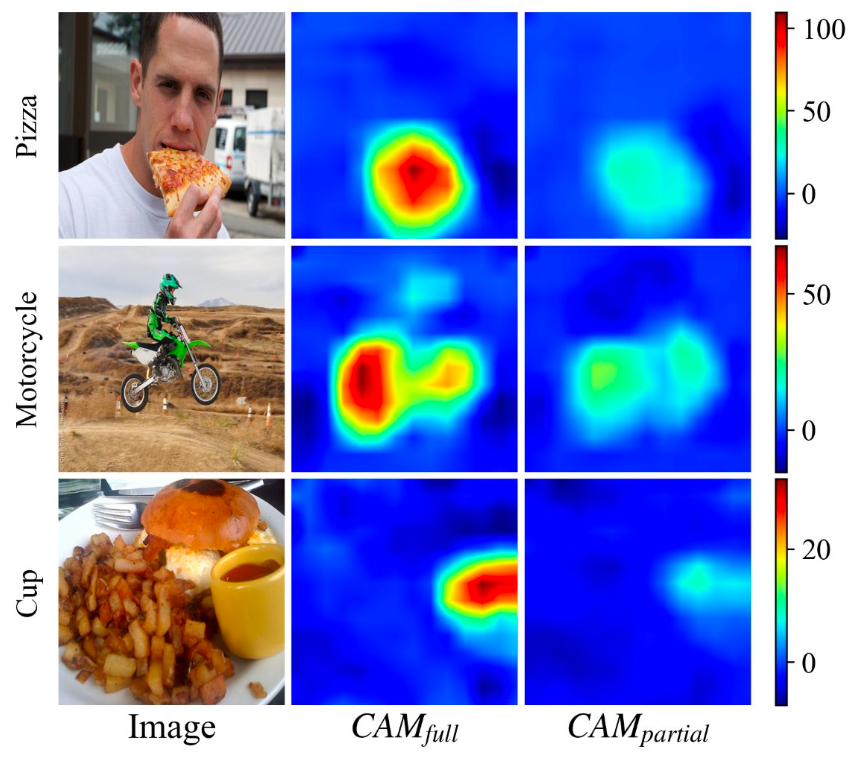
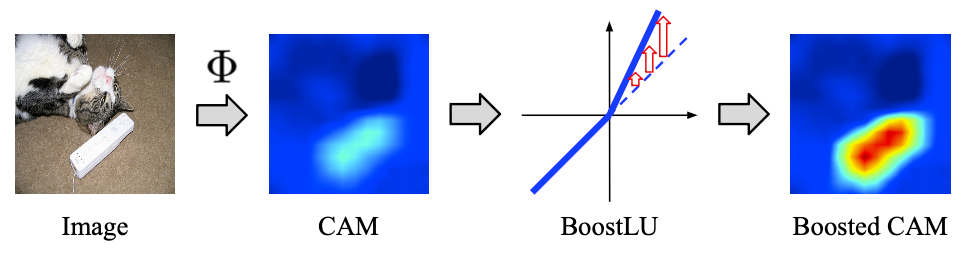
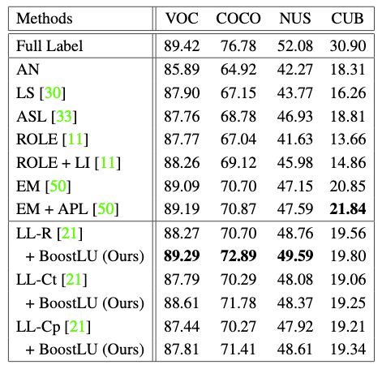
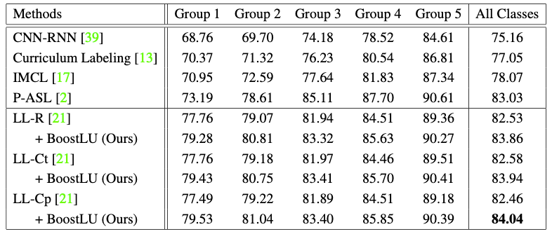
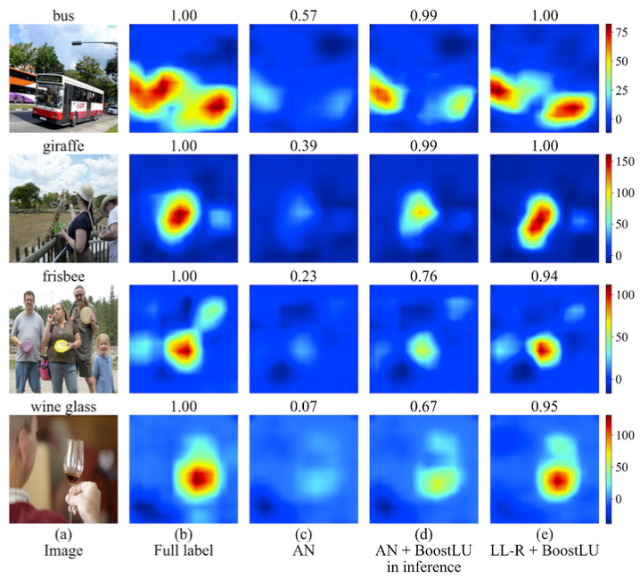

# Bridging the Gap between Model Explanations in Partially Annotated Multi-label Classification (CVPR 2023) | [Paper](https://openaccess.thecvf.com/content/CVPR2023/html/Kim_Bridging_the_Gap_Between_Model_Explanations_in_Partially_Annotated_Multi-Label_CVPR_2023_paper.html)

Youngwook Kim<sup>1</sup>, Jae Myung Kim<sup>2</sup>, Jieun Jeong<sup>1,3</sup>, Cordelia Schmid<sup>4</sup>, Zeynep Akata<sup>2,5</sup>, and Jungwoo Lee<sup>1,3</sup>

<sup>1</sup> <sub>Seoul National Univeristy</sub>  <sup>2</sup> <sub>University of T&uuml;bingen</sub> <sup>3</sup> <sub>HodooAI Lab</sub> <sup>4</sup> <sub>Inria, Ecole normale sup\'erieure, CNRS, PSL Research University</sub> <sup>5</sup> <sub>MPI for Intelligent Systems</sub>  

Primary contact : [ywkim@cml.snu.ac.kr](ywkim@cml.snu.ac.kr)

Observation on Model Explanation      |  Proposed Method (BoostLU)
:-------------------------:|:-------------------------:
  |  

## Abstract
Due to the expensive costs of collecting labels in multi-label classification datasets, partially annotated multi-label classification has become an emerging field in computer vision. One baseline approach to this task is to assume unobserved labels as negative labels, but this assumption induces label noise as a form of false negative. To understand the negative impact caused by false negative labels, we study how these labels affect the model's explanation. We observe that the explanation of two models, trained with full and partial labels each, highlights similar regions but with different scaling, where the latter tends to have lower attribution scores. Based on these findings, we propose to boost the attribution scores of the model trained with partial labels to make its explanation resemble that of the model trained with full labels. Even with the conceptually simple approach, the multi-label classification performance improves by a large margin in three different datasets on a single positive label setting and one on a large-scale partial label setting.


## Dataset Preparation
See the `README.md` file in the `data` directory for instructions on downloading and setting up the datasets.

## Model Training & Evaluation
You can train and evaluate the models by
```
python main.py --dataset [dataset] \
               --largelossmod_scheme [scheme] \
               --lr 1e-5 --num_epochs 10 --alpha 5
```
where ```[data_path]``` in {pascal, coco, nuswide, cub}, ```[largelossmod_scheme]``` in {LL-R, LL-Ct, LL-Cp}.

For now, we only support training codes for datasets with single positive label. Openimages will also be supported soon.

## Quantitative Results
Single positive label      |  Large-scale partial label (OpenImages V3)
:-------------------------:|:-------------------------:
  |  

## Qualitative Results
<p align="center">
</img>
</p>

## How to cite
If our work is helpful, please consider citing our paper.
```
@InProceedings{Kim_2023_CVPR,
    author    = {Kim, Youngwook and Kim, Jae Myung and Jeong, Jieun and Schmid, Cordelia and Akata, Zeynep and Lee, Jungwoo},
    title     = {Bridging the Gap Between Model Explanations in Partially Annotated Multi-Label Classification},
    booktitle = {Proceedings of the IEEE/CVF Conference on Computer Vision and Pattern Recognition (CVPR)},
    month     = {June},
    year      = {2023},
    pages     = {3408-3417}
}
```

## Acknowledgements
Our code is heavily built upon [Multi-Label Learning from Single Positive Labels](https://github.com/elijahcole/single-positive-multi-label) and [Large Loss Matters in Weakly Supervised Multi-Label Classification](https://github.com/snucml/LargeLossMatters).
